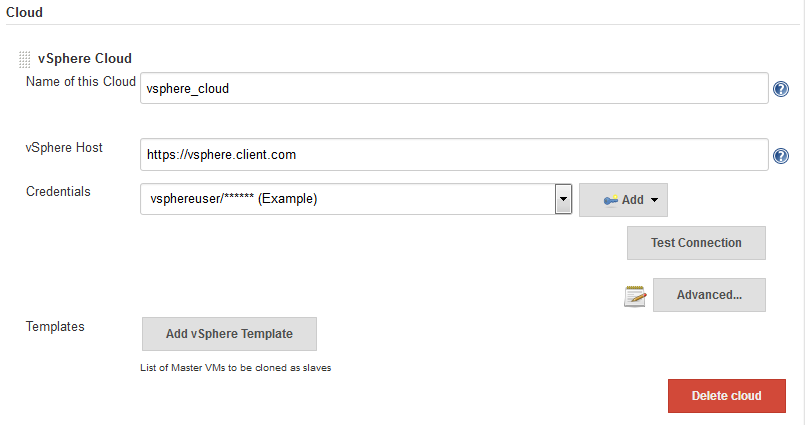
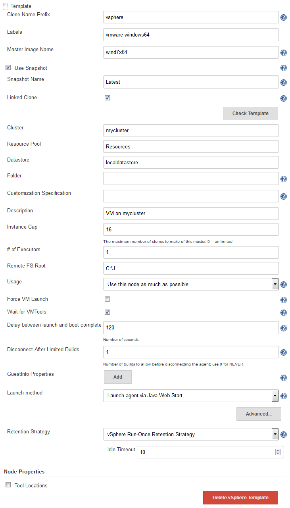
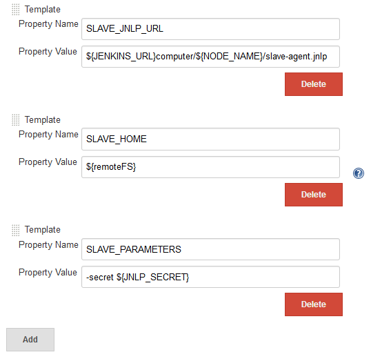
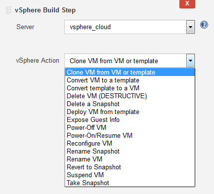

# Jenkins Configuration

This section describes how to control the functionality this plugin provides to Jenkins.

## vSphere Cloud Configuration

The first step is to configure Jenkins to know what vSphere server you will be using.
To do this you need to add a new "Cloud" in the Jenkins "Configure System" menu.



You will need to enter a display name for this vSphere cloud, the hostname of your vSphere server, and login credentials.
You can (in the Advanced... settings) also specify limits on the number of VMs to be created by Jenkins.

The "vSphere Host" is the name of the VMware vCenter service endpoint;
it usually has a format of
`https://host-name-or-IP-address`

The cloud configuration can be placed into maintenance mode to prevent access
to the vSphere server (e.g. while that is being updated or rebooted)
from the Jenkins jobs. They whould unblock automatically when the
maintenance mode is disabled.

The credentials specify the username and password used to log in to the vSphere Host.
If you do not have existing credentials defined for this within Jenkins then you will need to "Add" them and then refresh/reload this page.

The "Test Connection" button will test to see if your vSphere is accessible with the specified host name, user name and password.

Under "Advanced...", "Default Host Selection Mode" and "Default Host Selection Candidates"
let you set a cloud-wide default for how clones are placed on a host, applied to every
template and build step that uses this cloud and doesn't set its own value. See
["Controlling which ESXi host a clone lands on"](#controlling-which-esxi-host-a-clone-lands-on)
below - which hosts an account can write to, and whether DRS is licensed, are properties
of this vCenter environment, so setting them once here avoids repeating the same choice
on every template/pipeline call using this cloud.

The user entered when defining the cloud will need to have the following vsphere permissions:

|     |                                                                                                                                                      |
|-----|------------------------------------------------------------------------------------------------------------------------------------------------------|
| ■   | `Virtual machine.Provisioning.Clone virtual machine` on the virtual machine you are cloning.                                                   |
| ■   | `Virtual machine.Inventory.Create from existing` on the datacenter or virtual machine folder.                                                 |
| ■   | `Virtual machine.Configuration.Add new disk` on the datacenter or virtual machine folder.                                                      |
| ■   | `Resource.Assign virtual machine to resource pool` on the destination host, cluster, or resource pool.                                             |
| ■   | `Datastore.Allocate space` on the destination datastore or datastore folder.                                                                       |
| ■   | `Network.Assign network` on the network to which the virtual machine will be assigned.                                                             |
| ■   | `Virtual machine.Provisioning.Customize` on the virtual machine or virtual machine folder if you are customizing the guest operating system.   |
| ■   | `Virtual machine.Provisioning.Read customization specifications` on the root vCenter Server if you are customizing the guest operating system. |

## VM Clone Configuration

There are two ways to define the creation of a clone:

* Static configuration:
You can define the clone creation configuration globally.
It can later be referenced in the Jenkins job configuration by using a "label".
This configuration is done in the global Jenkins configuration.
  * This method is recommended for build jobs that "do not care about vSphere",
  e.g. basic compilation/test jobs which simply need a Jenkins node to run on.
* Per job configuration:
You can define the clone creation configuration individually in each job.
This configuration is done in the Jenkins job configuration.
  *This method is recommended for jobs which "know" that they are using vSphere to control a specific VM.

It is not uncommon to use both strategies,
e.g. per-job configuration to create VM templates for later use in the global configuration.

### Static configuration of clone creation

After adding a cloud you can configure Jenkins to create clones "on demand" by clicking on "Add vSphere Template" and then expanding the "Advanced..." section.
You may add as many templates that you wish.
Each template defines a means of creating a new VM to be used as a Jenkins node which will automatically be used to clone new nodes as necessary.
You can control which templates get used by specifying labels on the templates and "Restrict where build can run" on the jobs.



* Enter a "Clone Name Prefix",
that name will be used when creating new clones.
The new clone will be named: `<clone_prefix><UUID>`, where UUID is some dynamically created UUID added to the prefix.
Prefixes **MUST** be sufficiently unique that any given name can be uniquely matched to a single prefix.
* The "Master Image Name" is the name of the master image which will be used to make the new clones.
* Use snapshot: (optional)
If ticked, the new clone will be based on a Snapshot within the master image instead of the "live" image.
Ticking this enables the following:
  * Snapshot Name: The name of the snapshot to use, e.g. "Latest".
  * Linked Clone:
  A linked clone is where the disks of the clone are defined as a delta from the template's disks,
  meaning that storage space if only required on vSphere for the differences,
  rather than each clone requiring its own (full) copy of the template's disks.
  Recommended for short-lived VMs as otherwise it takes longer to clone the disks than it does for anything else.
* Enter Cluster, Resource Pool, Datastore, Folder, Customization Specification as required, this are settings how the clone will be created in vSphere.
Enter "Resources" as default for "Resource Pool" if you haven't explicitly defined resource pools in vCenter.
* Target Host, Host Selection Mode, Host Selection Candidates (all optional, under "Advanced..."):
control which ESXi host within the Cluster new clones are placed on.
See ["Controlling which ESXi host a clone lands on"](#controlling-which-esxi-host-a-clone-lands-on) below for details and examples.
Leaving these blank preserves the historical behaviour (vCenter's own default placement, unaffected by this feature).
* Labels:
You can use these labels to configure a job where it should be built.
Use the label in the box "Restrict where this project can be run" in the job configuration.
This is how Jenkins decides which template to use.
* Force VM Launch:
Launches (in vSphere, not Jenkins) the virtual machine when necessary.
* Wait for VMTools:
Useful if the virtual machine has VMTools installed;
when enabled, Jenkins will wait until VMTools is running before continuing with the connection
allowing a lower "Delay between launch and boot complete" value without sacrificing reliability.
* Delay between launch and boot complete:
Number of seconds to delay after starting the virtual machine (or after waiting for VMTools) before assuming the node is operational.
* Disconnect after Limited Builds: Will force the node agent to disconnect after the specified number of builds have been performed, triggering the disconnect action.
A Pipeline run counts as one build, however many `node {}` blocks it runs; the agent is disconnected when the run that reaches the limit is over.
* GuestInfo Properties:
you can use "guestinfos" to provide properties (e.g. the URL to the Jenkins Master and the JNLP "secret") to the clone.
This is especially useful if you chose "Java Web Start" (JNLP) as launch method, e.g. for a Windows VM.
See below for further details and example.
* Retention Strategy:
Whether to use each VM once before disposing of it (the "Run-Once" strategy) or to allow the VM to run multiple builds and only be disposed of once the VM has remained unused for too long (the "Keep-Until-Idle" strategy).
If your builds require a fresh VM then use "Run-Once", otherwise the "Keep-Until-Idle" will be more efficient.

GuestInfo properties (mentioned above) allow you to pass information from Jenkins to the newly started VMs.
If you are using the SSH launch method then you may not need this, but if you are using Java Web Start (JNLP) then this will be needed to tell your agent.jar process where the Jenkins server is, what node it is, the JNLP "secret" etc.
For example, to pass the data necessary for the newly-started VM to start a JNLP agent.jar process and connect back to Jenkins, you could set the following GuestInfo properties:



You would then need to ensure that, after bootup,
your VM would automatically use the vmware tools to reach each of these properties
(e.g. `vmtoolsd --cmd "info-get guestinfo.SLAVE_JNLP_URL"` to request the jnlp URL)
before starting the agent.jar with those arguments.

All the rest of the configuration variables are the same as when you define a Static Node.
Please see below for information on setting those configuration parameters.

### Per job configuration of clone creation

Add a new "vSphere Build Step" in the job configuration and select the desired action.

#### Build Steps



Build steps can be used to interact directly with your vSphere instances.
Typical use cases have been added as build steps.
If you would like to see more functionality in this plugin,
please open an enhancement request ticket to discuss the idea before raising a pull request for its implementation.
Note that any such functionality is dependent on there being support for it in the vSphere API and in the yavijava library.

#### Clone VM from Template or VM

This build step will clone an existing Template or VM to a new VM.
Linked clones are optional.
Cluster, Resource Pool, and Datastore can be specified.
Under "Advanced...", Host, Host Selection Mode and Host Selection Candidates can be used to control
which ESXi host the clone is placed on - see
["Controlling which ESXi host a clone lands on"](#controlling-which-esxi-host-a-clone-lands-on)
below.

#### Deploy VM from Template

This build step will create a VM from the specified template.
The template must have at least one snapshot before it can be cloned.
A linked clone may optionally be chosen.
The new VM will be placed in the same folder and storage device as the original template, and will use the specified ResourcePool and Cluster.
Under "Advanced...", Host, Host Selection Mode and Host Selection Candidates can be used to control
which ESXi host the clone is placed on - see
["Controlling which ESXi host a clone lands on"](#controlling-which-esxi-host-a-clone-lands-on)
below.

#### Controlling which ESXi host a clone lands on

##### Overview of dynamic hypervisor selection

The vCenter cluster with several hypervisor hosts can default where new clones would
appear, often swarming the same host on which the template is defined. Recent versions
of this plugin allow the Jenkins Configuration for a cloud, and/or the ultimate steps
to Clone or Deploy a VM, to require load-balancing among hosts in the cluster -- whether
calling on DRS (paid VMWare feature) or having the plugin itself make a choice based
on currently reported available resources. Note that these reports may be not real-time,
so a burst of VM creations in a short time frame can still pile up on the same "most
preferable" host as it was known in recent past.

Balancing can be further impacted by optionally assigning weights to the available
absolute and relative memory and CPU resources, for sysadmins to prioritize which
resource aspect is most important for them. This logic and its settings are explored
in much more detail in sections below, here is a short summary:

* By default, with all four weights at zero, each host's score is "1 minus the larger
  of its CPU use and its memory **use**, each as a fraction of that host's own capacity".
  For example, a host at 70% CPU and 40% memory scores 0.3 (1.0 minus 0.7).
  The host with the highest score, meaning **the one whose busier resource has the
  most room**, wins; any ties keep cluster order (the first in considered list wins).
* With weights set, each host gets four non-negative integers, as sysadmin-assigned
  "weights" for **available** room in each of the considered resources (absolute or
  relative to host capacity), and its score is their weighted average:
  ```
  score = (wCpuMhz*a + wCpuPct*b + wMemMB*c + wMemPct*d)
        / (wCpuMhz   + wCpuPct   + wMemMB   + wMemPct)
  ```
  - **`a`, free CPU in MHz**: the host's free MHz divided by the largest free MHz
    among the candidates. The host with the most free MHz gets 1.
  - **`b`, free CPU percent**: the host's free MHz divided by its own CPU capacity.
  - **`c`, free memory in MB**: the host's free MB divided by the largest free MB
    among the candidates.
  - **`d`, free memory percent**: the host's free MB divided by its own memory.
  - Weight variables for Jenkins configuration, JCasC YAML or step parameters are
    longer than in the short formula above, e.g.
    ```
    hostWeightFreeCpuMhz: '1',
    hostWeightFreeCpuPercent: '1',
    hostWeightFreeMemoryMB: '1',
    hostWeightFreeMemoryPercent: '1',
    ```

  Highest score wins with this formula as well. Logical implications:

  - Due to JCasC limitations, weights must be integers.
    To express `0.5 : 0.25`, use `2` and `1` instead.
  - Dividing by the **weight total** means only the proportions matter:
    assignments like `a = b = c = d = 1` and  `a = b = c = d = 100`
    have identical results.
  - A weight of `0` drops that measure, and the highest score still wins.
  - Hosts with **no** usage statistics (no report from vCenter was seen) are
    left out of the ranking entirely (not just seen as having zero score).
  - If ALL hosts' usage is not reported, the plugin picks no host and
    logs that it was unable to determine the load of any candidate host,
    and lets vSphere decide the placement (which is the original behaviour).

##### Details

By default (all three main fields left blank), clones are placed wherever vCenter's
own default placement logic decides -- in practice, often the same host the source
VM/template is registered on, which can unbalance load across a cluster over time.
**This is unchanged from previous plugin versions**: nothing about existing jobs,
pipelines, or templates changes unless you explicitly set one of these fields.

Three independent, optional mechanisms are available, in order of precedence:

1. **Host** (`host` on the build steps, `targetHost` on cloud templates) - pin the clone
   to one named ESXi host. Always wins if set. Works on any vSphere edition/license and
   any permission setup, including a service account restricted to a single host. Best
   for small/test labs, or whenever you want full manual control.

   *Example (build step):* `Host: esx-rack3-host07.example.com`

2. **Host Selection Mode** (`hostSelectionMode`) - used only when "Host" is blank, this
   lets the plugin pick automatically:
   * *(blank)* - inherits the cloud's own "Default Host Selection Mode" (see
     [vSphere Cloud Configuration](#vsphere-cloud-configuration) above), if any; if the
     cloud has no default either, this is unchanged legacy behaviour.
   * `NONE` - explicitly disables host selection **for this call site**, overriding the
     cloud's default even if it has one configured. Use this on the specific
     template/pipeline that should keep the old behaviour while everything else on the
     same cloud follows the cloud-wide default.
   * `LEAST_LOADED` - the plugin reads current CPU/memory usage for each candidate host
     and picks the least loaded one itself. No DRS license/feature is required, so this
     works on Essentials/Standard editions or on a cluster with DRS turned off. It does
     not know about VMware's own affinity/anti-affinity rules, HA reservations, or
     storage placement policies - it is a simple, dependency-free heuristic, well suited
     to quick/test setups or environments without a DRS license.
   * `DRS_RECOMMENDED` - asks vCenter's own DRS engine for a placement recommendation,
     restricted to the candidate hosts. This honours the cluster's real DRS/HA/affinity/
     storage policies, but **requires DRS to be enabled and licensed on the cluster**
     (vSphere Enterprise Plus, or an equivalent edition/license). If DRS is unavailable,
     disabled, or gives no recommendation, the plugin automatically falls back to
     `LEAST_LOADED` behaviour (logged as a warning) rather than failing the build. This
     is the recommended choice for enterprise environments that already rely on DRS, so
     that Jenkins agent placement follows the same policy as everything else.

   Either mode needs a cluster to search within. If "Cluster" is left blank, the plugin
   will use the vCenter's only cluster when there is exactly one; if there are zero or
   several clusters, it logs a message and falls back to letting vCenter decide (as if
   `hostSelectionMode` had been left blank too), rather than guessing.

3. **Host Selection Candidates** - an optional allow-list that restricts what "Host
   Selection Mode" is allowed to consider. In the classic UI it's a single comma-separated
   textbox (`hostSelectionCandidatesAsString`), e.g.
   `esx01.example.com, esx02.example.com, esx03.example.com`. In a pipeline or
   Configuration-as-Code YAML you can use that same comma-separated string under the name
   `hostSelectionCandidatesAsString`, or instead give a native list of host names under
   `hostSelectionCandidates` (`['esx01.example.com', 'esx02.example.com']`) - whichever is
   more convenient; both end up stored the same way (use only one of the two per
   template/step). Not every host visible in a cluster is necessarily usable by the
   vCenter account running the connection - a vCenter admin may restrict provisioning
   permission to a subset of hosts - so this is the mechanism to keep automatic selection
   within permitted hosts. It is **not verified live** against actual vCenter permissions:
   an incorrect entry, or a host the account cannot actually write to, only surfaces as a
   vCenter-side error when a clone is attempted.
   * *(blank)* - inherits the cloud's own "Default Host Selection Candidates", if any; if
     the cloud has no default either, every (connected, non-maintenance-mode) host in the
     cluster is a candidate.
   * a single comma (`,`) - explicitly overrides to "no restriction" **for this call
     site**, even if the cloud has a default candidate list configured. This is not
     blank, so it's treated as a deliberate override rather than "inherit", even though
     it also parses to zero host names.

4. **Require enough CPU cores** / **Require enough RAM** - two independent, opt-in
   checkboxes (`hostSelectionRequireCores`, `hostSelectionRequireMemory`; both **off by
   default**). When on, automatic selection (both `LEAST_LOADED` and `DRS_RECOMMENDED`)
   only considers candidate hosts whose total *physical* CPU core count, respectively
   RAM, is at least what the VM being created is configured with (read from the source
   VM or template). This compares absolute capacity, not what is currently free, so
   sites that deliberately oversubscribe (swap, hyperthreads, ...) can simply leave them
   off. If no candidate satisfies them, a message is logged and placement is left to
   vCenter, as when no usable candidate exists at all. They have no effect when an
   explicit "Host" is given. On the vSphere Cloud they are plain checkboxes that set the
   default for everything using that cloud. On a template or build step they are
   tri-state: left on *inherit* (`null`/unset in a pipeline or YAML) they use the cloud's
   default, while an explicit *Yes* (`true`) or *No* (`false`) overrides it for that call
   site, in either direction.
   Which size is compared:
   * For a **template** with `Reconfigure CPU` / `Reconfigure Memory` steps, the size
     those steps will set (they run right after the clone is created). If a value cannot be
     worked out ahead of time, such as one using a variable that only exists at build time,
     the master image's size is assumed for that component.
   * For the **Clone and Deploy build steps**, the size you give in their own
     **Number CPU Cores** (`cpuCores`) / **Memory Size in MB** (`memorySize`) fields, if set - these are applied in the
     same operation that creates the VM, so no separate reconfigure is needed - else the
     size of the source VM or template. They do **not** know about `Reconfigure*` steps that
     you run *after* cloning, because host placement has already happened by then: if those
     make the VM bigger or smaller than its source, the checks compare against the wrong
     size. Prefer the `cpuCores`/`memorySize` fields, or leave the checks off for such steps.
     (The source's cores-per-socket setting is kept unless you also set `coresPerSocket`, and
     `cpuCores` must be a multiple of it; this is checked before cloning.)
     These fields, `cpuCores`, `coresPerSocket`, `cpuLimitMHz` (a CPU *reservation* in MHz,
     named like the Reconfigure CPU step's) and `memorySize`, have the same names and meaning as
     the settings of the `Reconfigure CPU` / `Reconfigure Memory` steps, but are applied while the
     VM is being created. All are optional; unset ones keep the source's values.

   A third, separate check, **Require enough free RAM** (`hostSelectionRequireAvailableMemory`,
   also off by default), only considers hosts that have at least the VM's memory size *free
   right now*, so the hypervisor does not have to swap to make room for the new VM. Where "Require
   enough RAM" looks at the memory installed, this one looks at current usage as reported by
   vCenter: it changes by the minute, lags slightly, and several VMs created at the same moment
   can still pick the same host. A host whose memory usage is unknown does not qualify. It
   inherits and overrides exactly like the other two.

5. **Host weights** (on the vSphere Cloud, and optionally per template/build step) - what "most available host" means for
   `LEAST_LOADED` (and for the fallback when DRS gives no answer). Four whole-number weights,
   `hostWeightFreeCpuMhz`, `hostWeightFreeCpuPercent`, `hostWeightFreeMemoryMB` and
   `hostWeightFreeMemoryPercent`, for the host's free CPU in MHz, free CPU as a percentage of
   its capacity, free memory in MB and free memory as a percentage of its memory. Each host
   gets a score between 0 and 1, the weighted average of the four, and the highest score
   wins. Only the proportions matter (`1,1,1,1` is the same as `50,50,50,50`) and `0` ignores a
   measure. The two *absolute* measures are compared with the best of the candidate hosts (the
   host with the most free MHz scores 1 for that measure); the two *percentage* measures use
   each host's own capacity. Use the absolute ones to prefer bigger hosts with more to give,
   the percentage ones to prefer whichever host is least busy whatever its size.
   * all four **zero** (the default) - the original ranking: the host whose busier resource,
     CPU or memory, is the least used by percentage.
   * Whole numbers only: a decimal value from Configuration-as-Code would be silently read as
     zero.

   A template or build step can set the same four weights for itself (`hostWeightFreeCpuMhz`,
   `hostWeightFreeCpuPercent`, `hostWeightFreeMemoryMB`, `hostWeightFreeMemoryPercent`, given as
   text, with variables allowed in build steps). If it sets **any** of them, its four values
   **replace** the cloud's weights as a whole, and the ones it leaves blank count as `0`; if it
   sets none, the cloud's apply. Setting all four to `0` gives the original ranking despite
   weights on the cloud.

##### Choosing host weights

**There is no need to make weights for MHz or MB orders of magnitude larger (or smaller) than the
percentage ones to "compensate for the units".** Before weighting, every one of the four measures
is already turned into a number between 0 and 1: the percentage ones are the fraction of the host's
own capacity that is free, and the MHz and MB ones are the host's free amount divided by the
largest free amount among the candidates (so a host with 1000000 MB free and a best candidate with
1100000 MB free contributes about `0.91`, not `1000000`). The weights are therefore directly
comparable and only say how much *you* care about each measure, e.g. `1, 1, 5, 5` means that
memory counts five times as much as CPU, whichever way it is measured.

What does matter is how much a measure actually **differs between the candidates**. The influence
of a weight on the ranking is roughly the weight times the spread of that measure among the
hosts being compared:

* The MHz and MB measures are relative to the *best candidate*. In a cluster of similar hosts they
  come out close to each other (say `0.96` to `1.0`), so even a large weight on them separates the
  hosts only a little - it mostly lifts everybody's score towards 1 and thereby dilutes the
  measures that differ more. A big weight on a measure where all hosts look alike buys no influence.
* The same measures depend on which hosts are candidates: with a *candidate list* or *Require
  enough ...* filters the "best" is the best of the remaining hosts, and a single candidate always
  gets `1` for them. The percentage measures do not depend on the other hosts.
* In a cluster of equally sized hosts the absolute and the percentage measures nearly agree (a host
  with more free MHz also has more free percent), so it is enough to set one of the pair.
  The absolute measures are for clusters of **mixed sized** hosts, to prefer the bigger ones.

Recommendations:

* Start simple: all `1`, or only the two percentage weights (`0, 1, 0, 1`) to simply prefer the
  least busy host, and look at the ranking in the log (see below) before tuning.
* Weight the resource that actually runs out first higher - memory, for most virtualization
  clusters, as CPU is usually oversubscribed with less harm. A ratio of 2:1 to 10:1 is a strong
  preference already; there is no gain in `1000:1`.
* Use `0` to ignore a measure completely, rather than a tiny weight.
* Remember the weights are whole numbers: to express `1 : 2.5`, use `2` and `5`.
* The log shows each candidate's score and free CPU/memory, so a weight change can be checked on
  real numbers without provisioning anything. Scores that differ only in the third decimal are, for
  all practical purposes, a tie, and as the statistics lag behind, the winner among such hosts can
  change from one clone to the next.

Example from a real cluster, with the weights `free CPU MHz=1, free CPU %=1, free RAM MB=5, free RAM %=5`
(total `12`):

```
Ranking 3 candidate host(s) by weights[free CPU MHz=1, free CPU %=1, free RAM MB=5, free RAM %=5]:
  Host "virthost3.domain.com": score 0.730 (free CPU 48926 MHz = 51%, free memory 1011648 MB = 49%)
  Host "virthost1.domain.com": score 0.728 (free CPU 54149 MHz = 57%, free memory 986833 MB = 47%)
  Host "virthost2.domain.com": score 0.724 (free CPU 42184 MHz = 44%, free memory 1027075 MB = 49%)
Clone of VM "centos10-template" will be placed on host "virthost3.domain.com".
```

The four measures of each host, as the formula sees them (the best free MHz, 54149, and the best
free MB, 1027075, are the reference of the two absolute ones), approximately because the log rounds
the percentages:

| Host      | MHz `a` (weight 1) | CPU % `b` (1) | MB `c` (5) | RAM % `d` (5) | Score |
|-----------|--------------------|---------------|------------|---------------|-------|
| virthost3 | 0.90               | 0.51          | 0.99       | 0.49          | 0.73  |
| virthost1 | 1.00               | 0.57          | 0.96       | 0.47          | 0.73  |
| virthost2 | 0.78               | 0.44          | 1.00       | 0.49          | 0.72  |

Things this shows:

* The three hosts are practically tied. The free memory in MB is within 4% across the hosts, and the
  free memory percentage within two points, so in spite of their weight of 5 these two measures
  move the scores apart by only about `0.016` and `0.008`. The MHz measure, with weight 1, separates
  them about as much (`0.018`) because the hosts really differ in free CPU. The `0.73` that every
  host scores is mostly the memory measures being near `1` and `0.5` for all of them.
* `virthost1` has the most free CPU (57%, and the most MHz) but a little less free memory, so
  the memory-heavy weights make it second. If CPU is what really limits these clones, weights
  like `5, 5, 1, 1` would pick `virthost1` clearly (about `0.77` against `0.71` for `virthost3`
  and `0.63` for `virthost2`), and `1, 1, 1, 1` would pick it as well (`0.75`, `0.72`, `0.68`).
  Which of the hosts is "right" is the decision the weights express, not something the plugin can tell.

##### Keeping overloaded hosts off the list, and waiting for a free one

Weights only choose among the hosts that are acceptable; **limits** decide which hosts are
acceptable at all. On the vSphere Cloud (under *Advanced*) an admin can set the minimal free
resources a host must have *right now* to be considered:

| Setting                    | Meaning                                                               |
| -------------------------- | --------------------------------------------------------------------- |
| `hostMinFreeCpuMhz`        | free CPU in MHz (absolute)                                            |
| `hostMinFreeCpuPercent`    | free CPU as a percentage of the host's own capacity, 0-100 (relative) |
| `hostMinFreeMemoryMB`      | free RAM in MB (absolute)                                             |
| `hostMinFreeMemoryPercent` | free RAM as a percentage of the host's own memory, 0-100 (relative)   |

A host with less free than a limit is ruled out (the log says which limit); a host must satisfy
every limit that is set, and one whose usage is unknown cannot be shown to, so it is ruled out too.
`0`, the default, switches a limit off, so nothing changes until you set one. Use the absolute
limits for farms of similar hosts, and the relative ones for mixed farms - e.g.
`hostMinFreeCpuPercent: 20` and `hostMinFreeMemoryPercent: 10` mean "never start a new VM on a
host that is over 80% CPU-busy or has less than a tenth of its RAM free".

A template or build step can set the same four limits for itself (given as text, so variables
work), with the same rule as for weights: leave all four blank to use the cloud's; if **any** is
set, the four values replace the cloud's limits as a whole and the blank ones count as `0`. Setting
all four to `0` therefore lifts the cloud's limits for that call.

Limits apply whenever automatic host selection runs (`LEAST_LOADED` or `DRS_RECOMMENDED`). They
are not applied to a fixed `host`, which always wins, nor when no mode is set.

Because the limits can leave **no** host - and so can other situations - automatic host selection
can **wait** for a suitable host to become available. `hostSelectionWaitSeconds` says for how long:

* `0` (the default): do not wait;
* a positive number: look at the hosts' load again every 15 seconds for up to that many seconds,
  and carry on as soon as one qualifies;
* `-1` (or, in the text fields of build steps and templates, `infinite`): wait for as long as it
  takes. An aborted build stops waiting.

It applies whenever no host can be used at the moment, whatever the reason, and the build log says
which one, whether the build will wait (and for how long) or give up right away, and what giving up
means, at the moment the situation is found:

| Reason (`HostSelectionWaitReason`) | Situation | Assumed to be |
| ---------------------------------- | --- | --- |
| `BELOW_FREE_RESOURCE_LIMITS`       | every usable host has less free CPU/RAM than the limits | transient |
| `NO_HOST_WITH_FREE_RAM_FOR_VM`     | with *Require enough free RAM*, no host has the VM's memory size free right now | transient |
| `NO_USABLE_HOSTS`                  | all hosts disconnected, in maintenance mode, or not among the candidates | persistent |
| `NO_HOST_FITS_VM_SIZE`             | no host has enough cores/RAM for the VM, as the *Require enough ...* settings ask | persistent |
| `NO_USAGE_STATISTICS`              | no candidate host reports CPU/memory usage (`LEAST_LOADED` needs it; `DRS_RECOMMENDED` does not) | persistent |

*Giving up* (not waiting, or the time ran out) means **failing** the clone/deploy when it was the
free resource limits that ruled out every host - vCenter must not then place the VM regardless of
them - and, in all other situations, leaving the placement to vCenter, as it always was. So with the
default of `0` nothing changes for setups without limits. After a wait, the situation may have
changed; what counts is the last one seen.

Set it on the cloud for a default, and override it per template or per *Clone VM*/*Deploy VM*
step (`hostSelectionWaitSeconds: '600'`; blank inherits). While waiting, the build occupies its
executor and a connection to vCenter, so a finite wait is advisable on busy farms.

A pipeline can also be told, at the moment the situation is found and logged - see
[the pipeline documentation](pipeline.md#being-told-that-no-host-is-available).

```yaml
jenkins:
  clouds:
    - vSphere:
        hostSelectionMode: "LEAST_LOADED"
        hostMinFreeCpuPercent: 20
        hostMinFreeMemoryMB: 4096
        hostSelectionWaitSeconds: 900   # up to 15 minutes
```

##### Not sending every request to the same host

The load of a host only shows after a new VM has started on it, so requests that arrive in quick
succession would all pick the same best-scoring host. `hostSelectionScoreDeviation` (a number from 0
to 1, or beyond) makes every host that scores at least *(1 - deviation)* times the best score an equally good
candidate, and picks one of them at random; the build log says so when it happens:

* `0` (the default): random among hosts with exactly the best score only;
* e.g. `0.1`: hosts within 10% of the best score;
* `1`: any host that has a score, i.e. reports usage;
* above `1` (e.g. `2`): **any available host at random**, whatever its load: reachable, not in
  maintenance, among the candidate hosts and not too small where its size is known - including hosts
  that report no usage statistics. The free resource limits and *Require enough free RAM*, which need
  usage figures, are not applied;
* a negative number: always the single top host (the first one on a tie), as before.

It can be set on the cloud, and overridden by a template or a *Clone VM*/*Deploy VM* step
(`hostSelectionScoreDeviation: '0.05'`; blank inherits the cloud's, any value set replaces it).
It does not apply when DRS recommends the host. In Configuration as Code, write the number in
quotes (`hostSelectionScoreDeviation: "0.1"`): an unquoted fraction is not picked up.

##### Seeing why a host was chosen

With a host selection mode set, the build console log (and the template's provisioning log)
lists the cluster's hosts, each with the reason it was ruled out (not connected, in
maintenance mode, not in the candidate list, too few cores, too little RAM, no usage
statistics), then every remaining candidate with its score and free CPU/memory, best first,
and finally the host chosen. When DRS decides, the log names the DRS recommendation instead of
scores. The cloud's CPU/memory figures are those vCenter reports at that moment.

##### Per-host VM folders

Some inventories group VMs in *logical* folders defined per host: the folder of a template has
the name of the host it lives on as one element of its path (e.g. `.../virt5x/kubevms` holding
a `kube_template` VM definition).

A clone requested without an explicit *Folder* parameter lands in the folder of its source by
default, so every clone *seems* (in vCenter Web-UI object tree) to belong to the template's
host, despite actively running on a possibly different host (due to an explicit `host` argument,
or due to load-balancing done by this plugin).

With `hostSelectionFolderFollowsHost` (cloud default `false`; templates and *Clone VM*/*Deploy VM*
steps can set `true`/`false`, blank inherits) the clone instead goes to the same folder under the
host the plugin chose, e.g. `.../virt4x/kubevms`. Short and fully qualified host names are matched
alike. If the source's folder path does not name its host, or there is no such folder for the chosen
host, the source's own folder is used and the log says so. An explicit folder always wins, and it
applies to any host the plugin sets - a fixed `host` too - and is only about where the VM is
listed, not where it runs.

##### Settings for the classic UI, pipeline and JCasC YAML

On templates and build steps, the *Require enough ...* settings are drop-downs in the classic UI,
which store an unset ("inherit") value as an empty string - bound through
`hostSelectionRequireCoresAsString` and `hostSelectionRequireMemoryAsString`. In a pipeline or
Configuration-as-Code YAML, use the real booleans `hostSelectionRequireCores` and
`hostSelectionRequireMemory` (or the string forms `'true'`/`'false'`/`''`), whichever is more
convenient; use one of the two per template/step.

In short: pick "Host" for a fixed lab setup, `LEAST_LOADED` if you want basic load
spreading without a DRS license, or `DRS_RECOMMENDED` if you're already on Enterprise
Plus (or similar) and want placement to follow the same DRS policy as the rest of the
cluster; use "Host Selection Candidates" whenever the automation account can't write to every
host vCenter shows you. If most templates/pipelines on a cloud should behave the same way,
set the mode and/or candidates once on the cloud itself and only override at specific
call sites that need to differ (including opting all the way back out with `NONE`/`,`).

#### Convert VM to Template

This build step will mark the specified VM as a template.
The VM must be powered down first, or the user must use the "force" option.

#### Convert Template to VM

This build step will convert a template into the VM. 

#### Delete VM

This build step will delete the specified VM.
At this time, templates will not be deleted by this build step.

As an additional precaution against accidental deletion, if the name or description associated with the vSphere Cloud changes after the Job has been saved, the job will need to be re-saved before it will function correctly.

**WARNING:** THIS IS A DESTRUCTIVE OPERATION THAT WILL DELETE THE VIRTUAL MACHINE WITHOUT ADDITIONAL CONFIRMATION.  IT CANNOT BE UNDONE.

#### Power-On / Resume VM

This build step will power on the specified VM and store the IP address in the "VSPHERE\_IP" environment variable.
The build step will wait as long as specified in the "timeout" field (max 3600 seconds).
This build step will resume suspended VMs as well.

#### Power-Off VM

This build step will power off the specified VM.
There is an optional "Graceful shutdown", to attempt a shutdown via VMware Tools, if it's installed.

#### Reconfigure VM

This build step will allow selectively reconfiguration of the VM.
The following reconfigurations are available:
* Edit CPU - change the number of cores and/or sockets.
* Edit Disk - add a new disk
* Edit RAM - change the amount of RAM
* Edit NIC - Add, edit or remove a NIC interface, specify label, MAC address and port group.
* Edit Notes - Add-to/replace the text "Notes" for the VM.

#### Rename Snapshot

This build step allows renaming of a snapshot.

#### Rename VM

This build step will allow renaming the VM

#### Suspend VM

This build step will suspend the specified VM. 

#### Revert to Snapshot

This build step will revert the specified VM to the specified snapshot.

#### Take Snapshot

This build step will take a snapshot of the specified VM using the specified Snapshot name, description, and whether or not to include memory in the snapshot. 

#### Delete a Snapshot

This build step will delete a specified snapshot from a specified VM.
It will optionally consolidate all of the VM's disks.

**WARNING:** THIS IS A DESTRUCTIVE OPERATION THAT WILL DELETE THE SNAPSHOT WITHOUT ADDITIONAL CONFIRMATION.  IT CANNOT BE UNDONE.

**Disclaimer:** This list is a guide only.
Additional capabilities are typically added by volunteers for whom functionality is usually a higher priority than documentation.
Further (and sometimes better) documentation can be found in the online help in the Jenkins UI.
