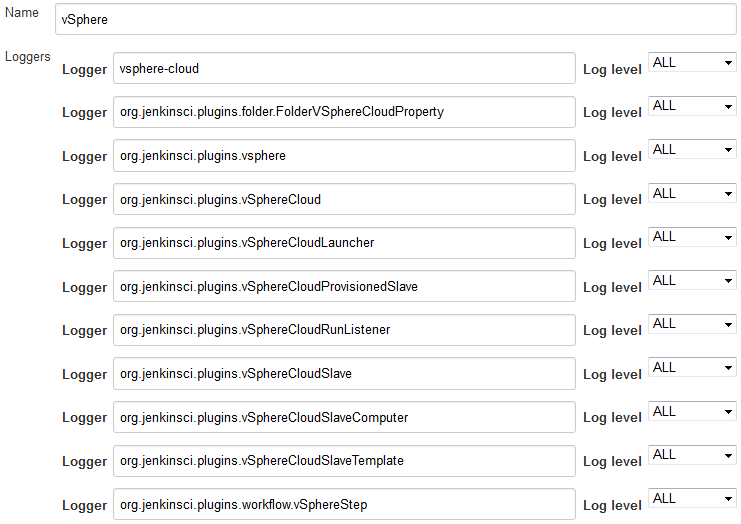

# Miscellaneous

## Debugging

To see what's going on "under the hood", you'll need to see the logs generated by the code.
To do that, you're best advised to go to `Manage Jenkins` -> `System Log` and
define a logger called e.g. `vSphere`.
In that new logger, you'll then need to add all the individual loggers that the plugin uses
... unfortunately, this is not presented in a nice clean fashion
(for historical reasons that are expensive to resolve).
The vSphere plugin code is not all under one nice neat package; you'll need to have a Logger for
`vsphere-cloud`
and a Logger for every Java class or package in the
[source code](../src/main/java),
while also taking care not to accidentally include anything that isn't vSphere
(e.g. the package
`org.jenkinsci.plugins.workflow`
includes lots of general Jenkins logs, so it's necessary to specify
`org.jenkinsci.plugins.workflow.vSphereStep`
instead) and set the Log level for each of these to `ALL`.

Once done, you'll end up with a log definition that looks something like
this:

Once you've got that, save it, and then you'll see any future activity in that system
log - these logs are likely to reveal more detail than shows up in any build logs,
and may help explain why node VMs aren't coming online as expected etc.

## Common issues

If you see that VMs are being created successfully but they're not coming "online" on Jenkins
then you probably have an error in the way the node connects to Jenkins.

### SSH
* for SSH login problems, check the node's log in Jenkins (before it disappears along with the node once Jenkins gives up on it).
* Telling Jenkins to verify the VM's host key is the default option for the SSH connection code so,
if your VMs SSH host key is not known to Jenkins already, you may need to use a non-verifying strategy.
* Make sure the credentials Jenkins is logging in with are accepted by your VM's sshd.
* Make sure your VM's `java` is on the path or in a location the SSH code checks for.

### JNLP / Webstart
* ensure that the VM itself is being provided with the GuestInfo information it requires;
you can see that the vSphere hypervisor UI for the VM (not in Jenkins; in your vSphere server).
* ensure that the code on the VM is successfully obtaining the expected GuestInfo information.
Ensuring that your startup code logs to the VM's console is helpful.
* ensure that the code is able to use that to communicate with the Jenkins master;
e.g. check the VM's network layer.

## Compatibility
This plugin is supposed to work in the following environments:
* A licensed vCenter 4.0 and higher.
An evaluation license for vCenter should work.
* A licensed ESX 4.0 or higher, or ESXi 4.0 or higher stand alone host.
For some actions like start/stop of a VM the ESX(i) is sufficient, for other actions you need the vCenter management application.
* NOT TESTED, but should work in theory: VMware Server

This plugin will NOT work with the following VMWare products:
* VMWare Player, Fusion, or Workstation (no remote APIs)
* The free ESXi server (remote APIs only work for the vSphere Client)

## Notes
* In some cases, starting a VM might cause vSphere to prompt the user to answer a question regarding the copying or moving of a VM.
This plugin will use the default answer, which is "I copied it."
* A great deal of thanks to the authors of the [Lab Manager Plugin](https://plugins.jenkins.io/labmanager);
their code was heavily copied to make this plugin.
