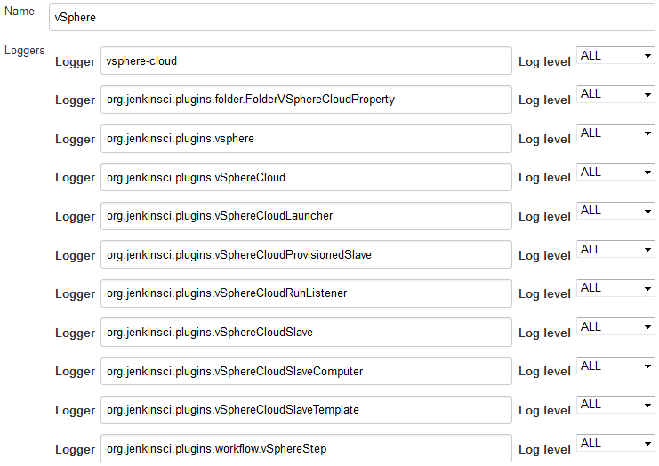

# Miscellaneous

## Debugging

To see what's going on "under the hood", you'll need to see the logs generated by the code.
To do that, you're best advised to go to `Manage Jenkins` -> `System Log` and
define a logger called e.g. `vSphere`.
In that new logger, add the logger
`org.jenkinsci.plugins.vsphere`
(which covers the plugin code, as it is all in this Java package and its sub-packages),
plus the two classes that are not in it, for historical reasons
(and which are not covered by a wider logger, as their packages hold lots of general Jenkins logs):
`org.jenkinsci.plugins.workflow.vSphereStep` and
`org.jenkinsci.plugins.folder.FolderVSphereCloudProperty`.
Set the Log level for each of these to `ALL`.

Before the classes were moved into that package (see [below](#classes-that-were-moved)), a logger
called `vsphere-cloud` and a logger for every Java class of the plugin were needed: if you have a
log recorder like that, it no longer logs the cloud, so replace its entries with the ones above.

Once done, you'll end up with a log definition that looks something like
this:

Once you've got that, save it, and then you'll see any future activity in that system
log - these logs are likely to reveal more detail than shows up in any build logs,
and may help explain why node VMs aren't coming online as expected etc.

## Common issues

If you see that VMs are being created successfully but they're not coming "online" on Jenkins
then you probably have an error in the way the node connects to Jenkins.

### SSH
* for SSH login problems, check the node's log in Jenkins (before it disappears along with the node once Jenkins gives up on it).
* Telling Jenkins to verify the VM's host key is the default option for the SSH connection code so,
if your VMs SSH host key is not known to Jenkins already, you may need to use a non-verifying strategy.
* Make sure the credentials Jenkins is logging in with are accepted by your VM's sshd.
* Make sure your VM's `java` is on the path or in a location the SSH code checks for.

### JNLP / Webstart
* ensure that the VM itself is being provided with the GuestInfo information it requires;
you can see that the vSphere hypervisor UI for the VM (not in Jenkins; in your vSphere server).
* ensure that the code on the VM is successfully obtaining the expected GuestInfo information.
Ensuring that your startup code logs to the VM's console is helpful.
* ensure that the code is able to use that to communicate with the Jenkins master;
e.g. check the VM's network layer.

## Compatibility
This plugin is supposed to work in the following environments:
* A licensed vCenter 4.0 and higher.
An evaluation license for vCenter should work.
* A licensed ESX 4.0 or higher, or ESXi 4.0 or higher stand alone host.
For some actions like start/stop of a VM the ESX(i) is sufficient, for other actions you need the vCenter management application.
* NOT TESTED, but should work in theory: VMware Server

This plugin will NOT work with the following VMWare products:
* VMWare Player, Fusion, or Workstation (no remote APIs)
* The free ESXi server (remote APIs only work for the vSphere Client)

## Notes
* In some cases, starting a VM might cause vSphere to prompt the user to answer a question regarding the copying or moving of a VM.
This plugin will use the default answer, which is "I copied it."
* A great deal of thanks to the authors of the [Lab Manager Plugin](https://plugins.jenkins.io/labmanager);
their code was heavily copied to make this plugin.

## Classes that were moved

For historical reasons, a number of classes of this plugin were directly in the `org.jenkinsci.plugins`
Java package, which made it hard to set up logging and auditing for the plugin alone. They are now in
`org.jenkinsci.plugins.vsphere`, with the same simple names:

| Before                                          | Now                                                  |
|-------------------------------------------------|------------------------------------------------------|
| `org.jenkinsci.plugins.vSphereCloud`            | `org.jenkinsci.plugins.vsphere.vSphereCloud`          |
| `org.jenkinsci.plugins.vSphereCloudSlave`       | `org.jenkinsci.plugins.vsphere.vSphereCloudSlave`     |
| `org.jenkinsci.plugins.vSphereCloudProvisionedSlave` | `org.jenkinsci.plugins.vsphere.vSphereCloudProvisionedSlave` |
| `org.jenkinsci.plugins.vSphereCloudSlaveTemplate` | `org.jenkinsci.plugins.vsphere.vSphereCloudSlaveTemplate` |
| `org.jenkinsci.plugins.vSphereCloudSlaveComputer` | `org.jenkinsci.plugins.vsphere.vSphereCloudSlaveComputer` |
| `org.jenkinsci.plugins.vSphereCloudLauncher`    | `org.jenkinsci.plugins.vsphere.vSphereCloudLauncher`  |
| `org.jenkinsci.plugins.vSphereCloudRunListener` | `org.jenkinsci.plugins.vsphere.vSphereCloudRunListener` |

**What keeps working**
* Pipelines, Freestyle jobs and the Configuration as Code of the plugin (`vSphere`, `esxiSsh`, `vsphereRunOnceCloud`
  and the other symbols, the `vSphere` pipeline step, `step([$class: 'VSphereBuildStepContainer', ...])`): none of them
  names these classes.
* What Jenkins has stored: the clouds in `config.xml`, the agents in `nodes/*/config.xml`, and the clouds of
  folders in the `config.xml` of the folder, that use the old names as XML elements (or as `class="..."`)
  are read as before, as the old names are aliases of the new classes (`LegacyClassNames`). What is saved
  after that has the new names. XML posted to Jenkins (the CLI, the REST API, `jenkins-cli create-node`)
  with the old names is accepted too.

**What does not**
* **Downgrading the plugin** after Jenkins has saved its configuration with the new names: the older plugin
  does not know them, and Jenkins will complain about, and skip, the clouds and agents that have them.
  Keep a backup of `$JENKINS_HOME` (`config.xml`, `nodes/`, folders) from before the upgrade.
* **Java code** (other plugins, or Groovy in the script console, `init.groovy.d` or Job DSL) that imports or names
  the classes above (`instanceof org.jenkinsci.plugins.vSphereCloud`, `import org.jenkinsci.plugins.vSphereCloud`,
  `Class.forName(...)`, a `class.name == '...'` filter on `Jenkins.get().clouds`): change the name to the new one;
  there are no deprecated classes left under the old names. As this changes the API of the plugin, it is a
  change that calls for a new major version number. A plugin that depends on this one should be compiled
  against the new version; a binary built against the old one fails to link with `NoClassDefFoundError`.
* **JSON** form data with `"stapler-class": "org.jenkinsci.plugins.vSphereCloud"` (and the like), and a
  `$class` with the full old name in a script: use the new name.
* **Log recorders** and log configuration (see [Debugging](#debugging)); the logger of the cloud was called
  `vsphere-cloud`, and is now named after its class, `org.jenkinsci.plugins.vsphere.vSphereCloud`, as the other loggers are.
